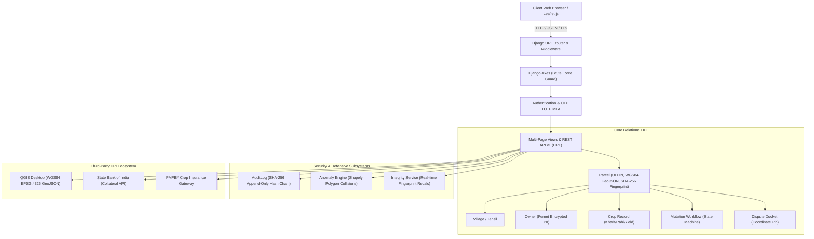
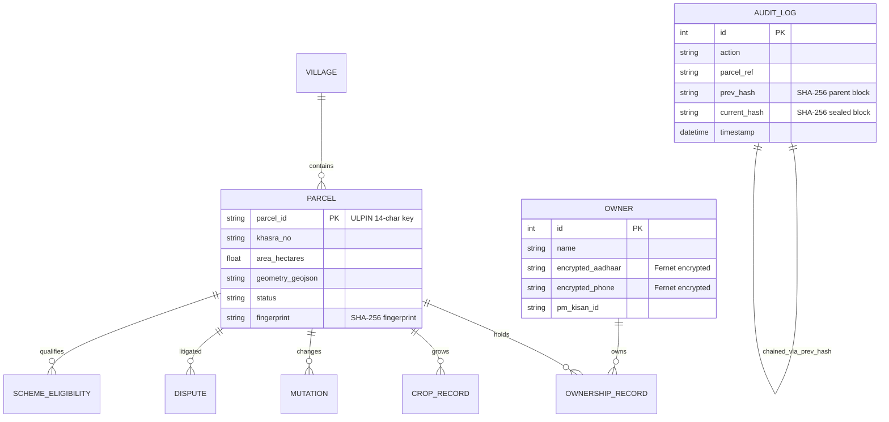

# BhuRaksha System Architecture

## Architecture Diagram

```mermaid
graph TD
    Client["Client Web Browser / Leaflet.js"] -->|HTTP / JSON / TLS| Router["Django URL Router & Middleware"]
    Router --> Axes["Django-Axes (Brute Force Guard)"]
    Axes --> Auth["Authentication & OTP TOTP MFA"]
    Auth --> Views["Multi-Page Views & REST API v1 (DRF)"]
    
    subgraph Core Relational DPI
        Views --> ParcelModel["Parcel (ULPIN, WGS84 GeoJSON, SHA-256 Fingerprint)"]
        ParcelModel --> VillageModel["Village / Tehsil"]
        ParcelModel --> OwnerModel["Owner (Fernet Encrypted PII)"]
        ParcelModel --> CropModel["Crop Record (Kharif/Rabi/Yield)"]
        ParcelModel --> MutationModel["Mutation Workflow (State Machine)"]
        ParcelModel --> DisputeModel["Dispute Docket (Coordinate Pin)"]
    end

    subgraph Security & Defensive Subsystems
        Views --> AuditLog["AuditLog (SHA-256 Append-Only Hash Chain)"]
        Views --> AnomalyEngine["Anomaly Engine (Shapely Polygon Collisions)"]
        Views --> IntegrityService["Integrity Service (Real-time Fingerprint Recalc)"]
    end

    subgraph Third-Party DPI Ecosystem
        Views --> QGIS["QGIS Desktop (WGS84 EPSG:4326 GeoJSON)"]
        Views --> Bank["State Bank of India (Collateral API)"]
        Views --> PMFBY["PMFBY Crop Insurance Gateway"]
    end
```

## Entity-Relationship (ER) Diagram

```mermaid
erDiagram
    VILLAGE ||--o{ PARCEL : contains
    PARCEL ||--o{ OWNERSHIP_RECORD : holds
    OWNER ||--o{ OWNERSHIP_RECORD : owns
    PARCEL ||--o{ CROP_RECORD : grows
    PARCEL ||--o{ MUTATION : changes
    PARCEL ||--o{ DISPUTE : litigated
    PARCEL ||--o{ SCHEME_ELIGIBILITY : qualifies
    AUDIT_LOG ||--|| AUDIT_LOG : chained_via_prev_hash

    PARCEL {
        string parcel_id PK "ULPIN 14-char key"
        string khasra_no
        float area_hectares
        string geometry_geojson
        string status
        string fingerprint "SHA-256 fingerprint"
    }

    OWNER {
        int id PK
        string name
        string encrypted_aadhaar "Fernet encrypted"
        string encrypted_phone "Fernet encrypted"
        string pm_kisan_id
    }

    AUDIT_LOG {
        int id PK
        string action
        string parcel_ref
        string prev_hash "SHA-256 parent block"
        string current_hash "SHA-256 sealed block"
        datetime timestamp
    }
```
